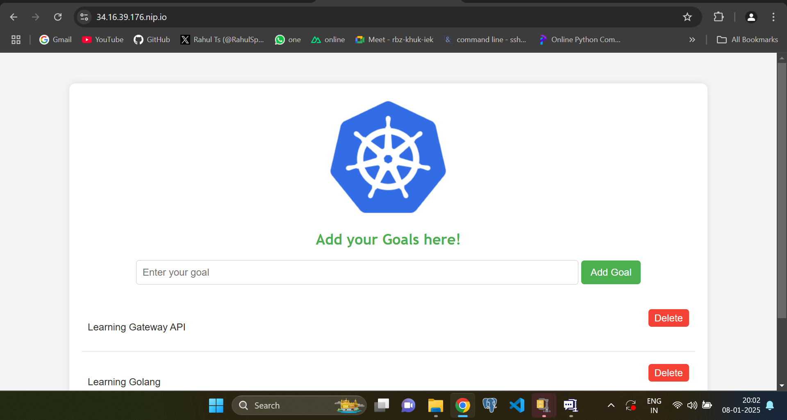
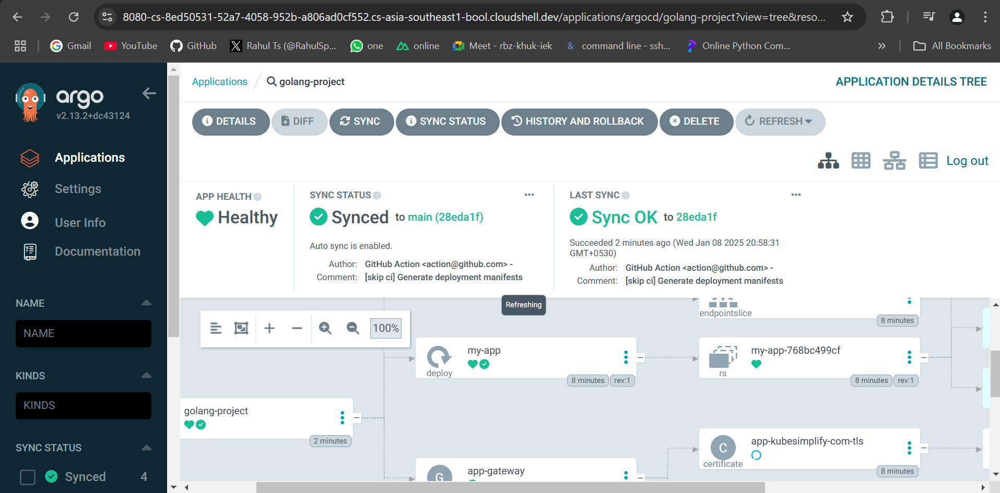

A Golang applciation build with Gin framework, containerized with Docker, orchestrated with Kubernetes, Github Actions for Continuous Integration, ArgoCD for Continuous Delivery, Prometheus for metrics, Grafana for visualization and GatewayAPI for routing and TLS.

# Running Locally 

## Initialising for base image
```
bsf init
``` 
## Building OCI artifact using bsf and ko
```
bsf oci pkgs --platform=linux/amd64 --tag=prod-v1 --push --dest-creds ${USER}:${PASSWORD}
KO_DOCKER_REPO=sp3ar007/golang-project KO_DEFAULTBASEIMAGE=sp3ar007/golang-proj:base ko build --bare -t v1 .
```
## Running using Docker
```
docker run -d --name grafana -p 3000:3000 grafana/grafana
docker run -d --name prometheus -p 9090:9090 -v $(pwd)/prometheus.yml:/etc/prometheus/prometheus.yml prom/prometheus
docker run --name local-postgres -e POSTGRES_USER=myuser -e POSTGRES_PASSWORD=mypassword -e POSTGRES_DB=mydb -p 5432:5432 -d postgres
docker exec -it local-postgres psql -U myuser -d mydb
CREATE TABLE goals (
    id SERIAL PRIMARY KEY,
    goal_name TEXT NOT NULL
);
docker run -d \
  --platform=linux/amd64 \
  -p 8080:8080 \
  -e DB_USERNAME=myuser \
  -e DB_PASSWORD=mypassword \
  -e DB_HOST=host.docker.internal \
  -e DB_PORT=5432 \
  -e DB_NAME=mydb \
  -e SSL=disable \
  sp3ar007/golang-project:sha-073cd9c
```    

# Kubernetes Deployment

## Installing basic componenets cert manager, nginx fabric for gateway API, Prometheus. for monitoring and Grafana for visualization. 

### Cert Manager
```
kubectl apply -f https://github.com/cert-manager/cert-manager/releases/download/v1.15.3/cert-manager.yaml
```
### Edit cert-manager deployment 
```
- --enable-gateway-api
```
```
kubectl rollout restart deployment cert-manager -n cert-manager
```

## Install Kube prometheus stack
```
helm repo add prometheus-community https://prometheus-community.github.io/helm-charts
helm repo update
helm install kube-prometheus-stack prometheus-community/kube-prometheus-stack --namespace monitoring --create-namespace

```
## Getting Grafana login secret for admin user

```
kubectl get secret --namespace monitoring kube-prometheus-stack-grafana -o jsonpath="{.data.admin-password}" | base64 --decode ; echo
kubectl port-forward svc/grafana 3000:80 -n monitoring
```

## Install Nginx fabric gateway
```
kubectl kustomize "https://github.com/nginxinc/nginx-gateway-fabric/config/crd/gateway-api/standard?ref=v1.3.0" | kubectl apply -f -
helm install ngf oci://ghcr.io/nginxinc/charts/nginx-gateway-fabric --create-namespace -n nginx-gateway
```


## Install Cloudnative postgress DB 

```
kubectl apply --server-side -f https://raw.githubusercontent.com/cloudnative-pg/cloudnative-pg/release-1.23/releases/cnpg-1.23.1.yaml
```

## Deploy PostgresDB cluster

```    
kubectl apply -f pg_cluster.yaml   
```
## Creating secret for cluster

```
kubectl apply -f secret.yaml
```

## Creating Table inside the database

```
kubectl exec -it my-postgresql-1 -- psql -U postgres -c "ALTER USER goals_user WITH PASSWORD 'new_password';"
kubectl port-forward my-postgresql-1 5432:5432
PGPASSWORD='new_password' psql -h 127.0.0.1 -U goals_user -d goals_database -c "

CREATE TABLE goals (
    id SERIAL PRIMARY KEY,
    goal_name VARCHAR(255) NOT NULL
);
"
```

## Create secret to be used by the application 
```
kubectl apply -f app-secret.yaml
```


## Application deployment(Currently this has the gateway for both Argocd and the application)
```
kubectl apply -f deploy/deploy.yaml
```

## Argocd installation 
```
kubectl create namespace argocd
kubectl apply -n argocd -f https://raw.githubusercontent.com/argoproj/argo-cd/stable/manifests/install.yaml
kubectl patch configmap argocd-cmd-params-cm  -n argocd --patch '{"data":{"server.insecure":"true"}}'
kubectl rollout restart deployment argocd-server -n argocd
kubectl get secret --namespace argocd argocd-initial-admin-secret -o jsonpath="{.data.password}" | base64 --decode ; echo 
```

## Create Route for ArgoCD  
```
kubectl apply -f route-argo.yaml
kubectl apply -f referencegrant.yaml
```

## Create Horizontal Pod Autoscaler for scaling of Pods
```
kubectl apply -f hpa.yaml

```
## Load testing 
```
k6s run load.js
```

# Deployment Details

## Kubernetes Deployment



## Continuous Delivery with ArgoCD



## Prometheus Metrics


